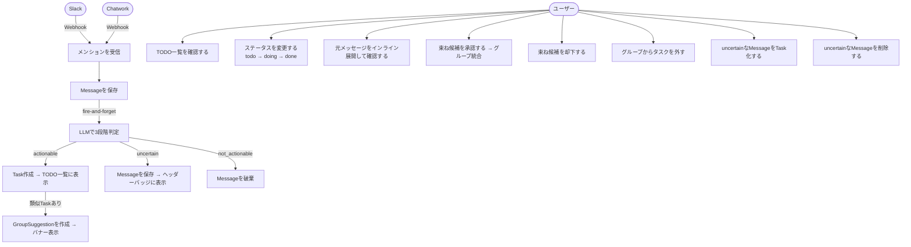

# UX設計：ユースケース図 & ワイヤーフレーム

---

## 1. ユースケース図



---

## 2. 画面構成

```
/tasks        TODO一覧（メイン画面・全操作をここで完結）
```

---

## 3. ワイヤーフレーム

### 3-1. TODO一覧画面（/tasks）

```
┌─────────────────────────────────────────────────────────────┐
│  Mension                             [🔔 未確認 3件]          │  ← ヘッダー（固定）
├─────────────────────────────────────────────────────────────┤
│  Todo 3  Doing 1  Done 2    [すべて] [Slack] [Chatwork]      │  ← サブヘッダー（固定）
├─────────────────────────────────────────────────────────────┤
│                                                             │
│  ┌─ 束ね候補 ────────────────────────────────────────────┐  │
│  │ ⚠ 「新規タスク」と「A社見積もり関連」グループは          │  │
│  │   同じ依頼かもしれません                               │  │
│  │   明確な期限付きの見積もり提出依頼が存在する             │  │
│  │                         [まとめる]   [別々のままにする] │  │
│  └──────────────────────────────────────────────────────┘  │
│                                                             │
│  ┌─ グループカード ──────────────────────────────────────┐  │
│  │ 🗂 A社見積もり関連  2件                       ▼ 開く  │  │
│  └──────────────────────────────────────────────────────┘  │
│                                                             │
│  ┌─ タスクカード ────────────────────────────────────────┐  │
│  │ B社への返信確認して                          [削除]   │  │
│  │ [chatwork] 鈴木                              昨日     │  │
│  │ ──────────────────────────────────────────────────── │  │
│  │ [Doing ▼]                          [元メッセージ ↓]  │  │
│  ├──────────────────────────────────────────────────────┤  │
│  │ ~~C社契約書レビュー~~                        [削除]   │  │  ← Done は打ち消し線
│  │ [slack] suzuki                               3日前    │  │
│  │ ──────────────────────────────────────────────────── │  │
│  │ [Done ▼]                           [元メッセージ ↓]  │  │
│  └──────────────────────────────────────────────────────┘  │
│                                                             │
└─────────────────────────────────────────────────────────────┘
```

**ポイント：**
- ヘッダー・サブヘッダーは常に固定表示
- ヘッダー右上に uncertain なMessage件数をバッジ表示、クリックでモーダル表示
- サブヘッダーにステータス別件数とサービスフィルターを配置
- 束ね候補は全件バナーで表示（5秒ごと自動更新）。類似タスクが既存グループに属する場合はグループ単位で1件に集約して表示
- グループはアコーディオン形式で開閉可能
- タスクカードで「元メッセージ ↓」をクリックするとカード内にメッセージ本文とpermalinkが展開
- ステータスはドロップダウンで即変更、件数カウンターもリアルタイム更新
- ソース（Slack/Chatwork）でフィルタリング可能

---

### 3-2. uncertain Messageモーダル

```
┌─────────────────────────────────────────────────────────────┐
│  未確認メッセージ（3件）  [全て削除] [全てタスク化] [×閉じる]  │
├─────────────────────────────────────────────────────────────┤
│                                                             │
│  ┌──────────────────────────────────────────────────────┐  │
│  │ [Slack]  yamada  30分前                              │  │
│  │ 「例のやつよろしく」                                  │  │
│  │                      [Taskにする]  [削除]            │  │
│  ├──────────────────────────────────────────────────────┤  │
│  │ [Chatwork]  田中  1時間前                            │  │
│  │ 「あれ、まだ？」                                      │  │
│  │                      [Taskにする]  [削除]            │  │
│  ├──────────────────────────────────────────────────────┤  │
│  │ [Slack]  suzuki  2時間前                             │  │
│  │ 「〜だと助かるんだけど」                              │  │
│  │                      [Taskにする]  [削除]            │  │
│  └──────────────────────────────────────────────────────┘  │
│                                                             │
└─────────────────────────────────────────────────────────────┘
```

**ポイント：**
- ヘッダーバッジをクリックで表示
- 「Taskにする」→ Task作成してモーダルから消える
- 「削除」→ Messageを物理削除してモーダルから消える
- 「全てタスク化」「全て削除」→ 確認ダイアログ後に一括処理

---

## 4. 未決事項

なし（全て確定済み）
