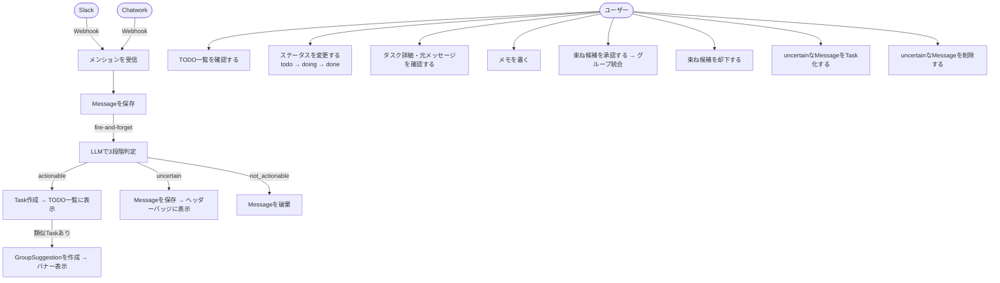

# UX設計：ユースケース図 & ワイヤーフレーム

---

## 1. ユースケース図



---

## 2. 画面構成

```
/tasks        TODO一覧（メイン画面）
/tasks/[id]   タスク詳細（元メッセージ確認・メモ記入）
```

---

## 3. ワイヤーフレーム

### 3-1. TODO一覧画面（/tasks）

```
┌─────────────────────────────────────────────────────────────┐
│  Mention→TODO                        [未確認 3件 ●]          │
├─────────────────────────────────────────────────────────────┤
│                                                             │
│  ┌─ 束ね候補 ────────────────────────────────────────────┐  │
│  │ ⚠ 「A社見積もり」と「納期は2週間で」は同じ依頼かもしれません │  │
│  │                         [まとめる]   [別々のままにする] │  │
│  ├──────────────────────────────────────────────────────┤  │
│  │ ⚠ 「B社返信」と「B社の件どうなった？」は同じ依頼かもしれません│  │
│  │                         [まとめる]   [別々のままにする] │  │
│  └──────────────────────────────────────────────────────┘  │
│                                                             │
│  フィルター: [すべて▼]  [Slack][Chatwork]                    │
│                                                             │
│  ┌──────────────────────────────────────────────────────┐  │
│  │ □  A社の見積もり明日までにお願い   [グループ] [todo▼]  │  │
│  │    Slack · @yamada · 2時間前                [詳細 →]  │  │
│  ├──────────────────────────────────────────────────────┤  │
│  │ □  納期は2週間って書いといて       [グループ] [todo▼]  │  │
│  │    Chatwork · 田中 · 1時間前               [詳細 →]  │  │
│  ├──────────────────────────────────────────────────────┤  │
│  │ □  B社への返信確認して                      [doing▼]  │  │
│  │    Chatwork · 鈴木 · 昨日                  [詳細 →]  │  │
│  ├──────────────────────────────────────────────────────┤  │
│  │ ✓  C社契約書レビュー                         [done▼]  │  │
│  │    Slack · @suzuki · 3日前                 [詳細 →]  │  │
│  └──────────────────────────────────────────────────────┘  │
│                                                             │
└─────────────────────────────────────────────────────────────┘
```

**ポイント：**
- ヘッダー右上に uncertain なMessage件数をバッジ表示、クリックでモーダル表示
- 束ね候補は全件バナーで表示
- グループに属するTaskは [グループ] バッジを表示（フラット表示）
- ステータスはドロップダウンで即変更
- ソース（Slack/Chatwork）でフィルタリング可能

---

### 3-2. uncertain Messageモーダル

```
┌─────────────────────────────────────────────────────────────┐
│  未確認メッセージ（3件）                              [×閉じる] │
├─────────────────────────────────────────────────────────────┤
│                                                             │
│  ┌──────────────────────────────────────────────────────┐  │
│  │ [Slack]  @yamada  30分前                             │  │
│  │ 「例のやつよろしく」                                  │  │
│  │                      [Taskにする]  [削除]            │  │
│  ├──────────────────────────────────────────────────────┤  │
│  │ [Chatwork]  田中  1時間前                            │  │
│  │ 「あれ、まだ？」                                      │  │
│  │                      [Taskにする]  [削除]            │  │
│  ├──────────────────────────────────────────────────────┤  │
│  │ [Slack]  @suzuki  2時間前                            │  │
│  │ 「〜だと助かるんだけど」                              │  │
│  │                      [Taskにする]  [削除]            │  │
│  └──────────────────────────────────────────────────────┘  │
│                                                             │
└─────────────────────────────────────────────────────────────┘
```

**ポイント：**
- ヘッダーバッジをクリックで表示
- 「Taskにする」→ Task作成してモーダルから消える
- 「削除」→ Messageを物理削除してモーダルから消える

---

### 3-3. タスク詳細画面（/tasks/[id]）

```
┌─────────────────────────────────────────────────────────────┐
│  ← 一覧に戻る                                                │
├─────────────────────────────────────────────────────────────┤
│                                                             │
│  A社の見積もり明日までにお願い                                │
│  ステータス: [todo▼]                          [削除]         │
│                                                             │
│  ─── メモ ────────────────────────────────────────────────  │
│  ┌──────────────────────────────────────────────────────┐  │
│  │ 自由にメモを残せます                                  │  │
│  │                                                      │  │
│  │                                          [保存]      │  │
│  └──────────────────────────────────────────────────────┘  │
│                                                             │
│  ─── 紐づくメッセージ ─────────────────────────────────────  │
│                                                             │
│  ┌──────────────────────────────────────────────────────┐  │
│  │ [Slack]  @yamada  2時間前                            │  │
│  │ 「A社見積もり明日までにお願い」                        │  │
│  │                               [Slackで開く ↗]        │  │
│  └──────────────────────────────────────────────────────┘  │
│                                                             │
│  ┌──────────────────────────────────────────────────────┐  │
│  │ [Chatwork]  田中  1時間前                            │  │
│  │ 「納期は2週間って書いといて」                          │  │
│  │                           [Chatworkで開く ↗]         │  │
│  └──────────────────────────────────────────────────────┘  │
│                                                             │
└─────────────────────────────────────────────────────────────┘
```

**ポイント：**
- メモは自由記述テキストエリア、保存ボタンで上書き
- 紐づくメッセージを時系列で表示
- 各メッセージから元のSlack/Chatworkに飛べる（permalink）
- ステータス変更・タスク削除はここでもできる

---

## 4. 未決事項

なし（全て確定済み）
